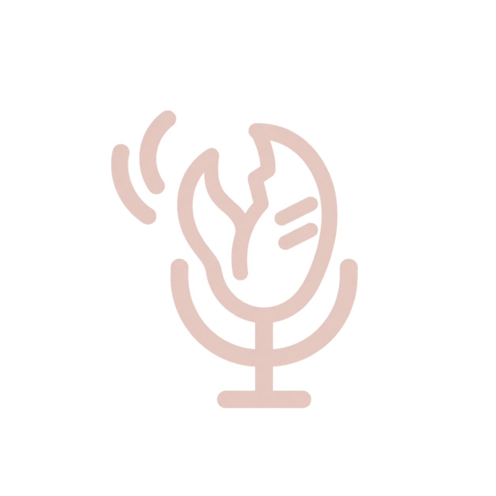
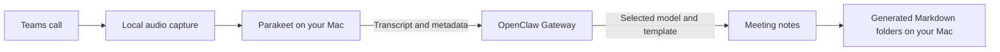

# ClawMinutes



Local Teams transcription on your Mac. AI meeting notes from your OpenClaw Gateway.

ClawMinutes records microphone and Teams audio after you choose Start, transcribes with Parakeet on the recording Mac, and sends the finished transcript and meeting metadata to OpenClaw. The Gateway generates notes using your chosen model and template. No meeting bot joins the call. The Mac helper is called `ocmh` and needs no local OpenClaw installation.



## What it does

- Prompts for a detected Teams meeting, with local Start and Dismiss controls.
- Captures your microphone and Teams application audio as separate tracks.
- Runs Parakeet v3 Core ML locally. ElevenLabs Scribe v2 is an optional, explicit cloud choice.
- Creates Gateway AI notes with editable templates and a configurable `provider/model` setting.
- Saves `notes.md`, `transcript.md`, and `metadata.json` in your chosen folder.
- Uses clean `yyyy.MM.dd-HHmm_Meeting-title` folder names, grouped by year and month for notes.
- Captures meeting titles and participant observations when Teams exposes them. Unsupported speaker names remain `Unknown speaker`.
- Offers icon-only or descriptive menu bar mode, with light and dark icons.

The supplied lobster-and-microphone logos follow the Mac's appearance in the pop-up, Settings and running app icon. The menu bar uses a transparent version of the central mark, with a coloured activity dot while working. Both original light and dark PNGs are included in helper builds.
- Can delete finished audio after checking transcript validity, archive readback, exported notes, and recording coverage. Failed or incomplete checks keep audio.

## Status and requirements

This is an experimental source release. Local recording, transcription, Gateway note generation, and archive readback have been exercised on real calls. Participant coverage and microphone reliability still have limitations. See [verification and limits](docs/verification.md).

The recording helper requires Apple Silicon, macOS 15 or later, Microsoft Teams, and microphone, Screen & System Audio Recording, and Accessibility permissions. Building currently requires Xcode 27.2 beta with Swift 6.4, Python 3, and `cloudflared`.

The Gateway plugin requires Node.js 24 or later and **OpenClaw 2026.9.7 or 2026.9.8**. The Meetings archive adapter currently uses those versions' internal store API and rejects other versions. This is a compatibility constraint, not a promise of support for every OpenClaw release.

## Build from source

On the Mac that will build the helper:

```sh
git clone https://github.com/Olli0103/clawminutes.git
cd clawminutes
brew install cloudflared
npm run build:native
python3 scripts/local-signing.py
npm run pack:helper
npm pack
```

Select Xcode 27.2 beta as your active developer directory. This is the toolchain used for the working local build. CI selects the same preview toolchain explicitly. Xcode 16.4 and 26.3 rejected actor-isolated Accessibility code and encountered compiler crashes in clean builds; those toolchains are currently unsupported. A command-line-tools-only installation is insufficient for this macOS app.

`local-signing.py` creates a private certificate for your local builds. Packaging reuses it so helper updates retain the same signing identity. Keep its signing directory private. You can instead provide `OPENCLAW_TEAMS_SIGNING_IDENTITY` and `OPENCLAW_TEAMS_SIGNING_KEYCHAIN`. A build without an available identity is signed ad hoc and may need new permission grants after updates. Local signing is not Apple Developer ID signing or notarization.

Packaging finds `cloudflared` on `PATH`, or uses `OPENCLAW_TEAMS_CLOUDFLARED`. The resulting `helper/recording-mac.zip` contains the app and installer. The npm archive contains the Gateway plugin and helper distribution. This repository does not include prebuilt apps or model weights.

## Install the Gateway plugin

Copy the npm archive to your existing Gateway host and run there:

```sh
openclaw plugins install ./openclaw-teams-transcribe-0.2.16.tgz --accept-capabilities
openclaw plugins enable teams-transcribe --accept-capabilities
openclaw teams-transcribe helper-export --output ./ocmh-recording-mac.zip
```

The package and plugin identifiers remain `openclaw-teams-transcribe` and `teams-transcribe` for compatibility. ClawMinutes is the project name.

## Install and connect the Mac helper

Extract `ocmh-recording-mac.zip` on the recording Mac, then run in the extracted directory:

```sh
python3 scripts/helper.py install --gateway https://your-gateway.example
```

Open the helper's Settings and connect the Gateway. Choose Cloudflare Access when your Gateway uses its GitHub sign-in, or use direct Gateway token authentication. Tokens are stored locally through macOS Keychain or Cloudflare's application-scoped session cache. Remote Gateways require HTTPS.

Grant the helper microphone, Screen & System Audio Recording, and Accessibility access. Use Check again after changing permissions. Teams system audio uses application-filtered, audio-only ScreenCaptureKit capture; the app registers no screen output and saves no screenshots or video.

Set up the Local only model before your first recording. Model setup downloads Parakeet; recording-time recognition does not silently download missing models or switch to a cloud backend.

## Notes, templates and files

In the helper's Settings, choose AI notes, Simple highlights, or Transcript only. Edit templates and select your notes folder. In the Gateway plugin settings, select **Notes model** as `provider/model` and the **Model credential owner**. AI notes use a simple completion with no tools or agent session.

```text
Your chosen notes folder/
  2026/10/
    2026.10.02-1000_Project-sync/
      notes.md
      transcript.md
      metadata.json
```

Internal archive IDs stay in metadata. Separate versions with the same timestamp and title receive a numeric suffix to preserve both. Existing generated notes are preserved on retries. Meeting detection times and observed participant names are partial evidence; invitees are unavailable without invitation data. See [notes, templates and metadata](docs/meeting-notes.md).

For a personal microphone, set **Your voice → Your name**. Use Shared microphone when several local people can be captured. A roster entry or acoustic voice cluster alone does not prove a remote speaker's name.

Saved meeting details offer **Identify speakers…** and **Regenerate notes…**. Both create separate versions and preserve the original notes. Select exact turns when confirming a speaker; local audio previews are available while audio is retained. See [meeting versions](docs/revisions.md) for the UI, identity contract and re-transcription commands. This source candidate has not been activated on a live helper or Gateway.

Settings and meeting details offer an explicit review before copying existing notes to another folder. It preserves edits and originals, checks staged copies and leaves the future default unchanged. See [copy existing notes](docs/notes-copy.md).

The meeting library searches local titles, notes and transcripts, with matching excerpts and an attention filter. Search stays on this Mac and reports documents it cannot read. See [meeting search](docs/meeting-search.md).

Failed AI notes offer transcript-only recovery or an explicit additional attempt when the existing budget permits it. Recovery preserves the original transcript and earlier failures; it cannot reset paid-attempt limits. See [notes recovery](docs/notes-recovery.md) for replay behavior and legacy-ledger limits.

Connection and delivery now require a [verified Gateway text/archive handshake](docs/gateway-capabilities.md). A successful HTTP response alone cannot send a meeting. The adapter checks its storage behavior with synthetic data in a temporary directory, while retaining the supported SDK version pins.

## Data flow and audio retention

Parakeet keeps audio and speech recognition on the recording Mac. The Gateway receives transcript text and approved metadata, including captured meeting and participant observations. Its selected AI provider receives that text for note generation. The plugin's ingestion endpoint rejects raw audio.

If you explicitly select ElevenLabs, audio goes directly from the Mac to ElevenLabs for speech recognition.

Recordings and retry receipts live under `~/.openclaw/teams-transcribe`. Audio is kept by default. Enable **Delete future audio after verified notes** to apply automatic verification and removal only to recordings started after opt-in. Historical recordings have a separate **Review recorded audio…** flow with explicit selection, fresh verification and deletion confirmation. See [audio cleanup](docs/audio-cleanup.md) for limits and resumable partial removal. Transcripts, notes, metadata, and deletion receipts remain. Deleting audio prevents later retranscription from those tracks.

The helper checks finished transcript delivery at launch and every minute while running. Failed saves retry after 30 seconds, 2 minutes, 10 minutes, then every 30 minutes, subject to the one-minute check. Retry times survive relaunch. Reconnecting or choosing **Retry pending saves** checks immediately. Settings shows the pending count. Each pass attempts at most five saves; active recordings and synthetic fixtures are excluded. A valid receipt must match the recording ID, utterance count and current transcript hash, and the exported files must exist. Older saved receipts without hashes require manual verification rather than automatic resend.

Run `ocmh archive-backlog` for a read-only delivery report. It distinguishes pending upload, pending local export, missing transcription, active recording and records needing review. With the helper stopped, `ocmh archive-backlog --retry` retries pending text saves. While it is running, use Settings. Retries never start recording, run speech recognition or send raw audio. The Gateway returns existing verified notes for an identical completed save, including recovery after a lost response; changed speech or meeting metadata requires a new revision.

Call-end detection recognizes English and German Teams end messages and call controls. A confirmed end remains remembered across partial Accessibility reads, with the existing 30-second stop countdown and **Keep recording** override. New call controls clear the remembered end. Missing controls alone, silence or a hidden window do not prove that a call ended.

Capture recovery monitors successful disk writes, including silent PCM. After ten seconds without progress, a failed stream, or a cumulative frame shortfall, it tries a new segment for the affected audio source. It keeps the other source running and limits retries to three with at least fifteen seconds between attempts. The transcript and Gateway notes retain gap evidence. Automatic audio deletion stays off for that recording when a gap is recorded. These protections have deterministic tests; live device-change recovery still needs verification.

## Update and remove

Use a newly built helper archive signed with the same identity. The installer refuses to replace an active recorder.

```sh
python3 scripts/helper.py update
python3 scripts/helper.py run
python3 scripts/helper.py remove
```

Removal preserves recordings and configuration. Remove the Gateway plugin separately using `openclaw plugins uninstall teams-transcribe` on its host.

## Development

The JavaScript contract tests need Node.js 24 or later and the development SDK. They do not require a running Gateway. This development dependency is separate from the installed recording helper:

```sh
npm install --ignore-scripts --package-lock=false
npm test
```

The macOS unit tests use Swift Package Manager:

```sh
swift test --package-path native -j 4
```

Hardware, model, and credential-dependent tests require their explicit fixtures or setup. A unit-test pass does not verify a live call. Generated recordings, logs, signing material, and private runtime evidence are excluded from Git.

## Diagnostics

Settings → Advanced → Save diagnostic report creates a new report without speech, names, paths or credentials. `ocmh diagnose --output /path/to/new-report.json` provides the same read-only check. See [diagnostics and pipeline progress](docs/diagnostics.md) for included fields and limits.

## Credits and license

MIT. The native helper builds on [Quill](https://github.com/humanitas-labs/quill) and [Andrew Jones's fork](https://github.com/bedeabza/quill). Original copyright notices and dependency licenses are retained in [notices](notices) and [reuse documentation](docs/reuse.md). Swift module names still use `quill` to preserve source provenance. Model weights download separately and have their own terms.

### Updating or removing a busy helper

Lifecycle commands refuse to replace or remove the helper during recording, transcription or Gateway archiving. They hold an exclusive OS file lock; native work holds shared locks on the same file. This also prevents a new recording from starting during replacement. Custom recording folders and unreadable metadata are checked before any stop or replacement. Recordings and configuration survive removal.

For the first update from a helper older than 0.2.9, wait until recording and transcription finish, then quit the helper before running the update. Older builds cannot report activity through the new lock protocol, so the installer refuses to signal a running older helper. Lock files stay in place; process exit releases ownership automatically.
